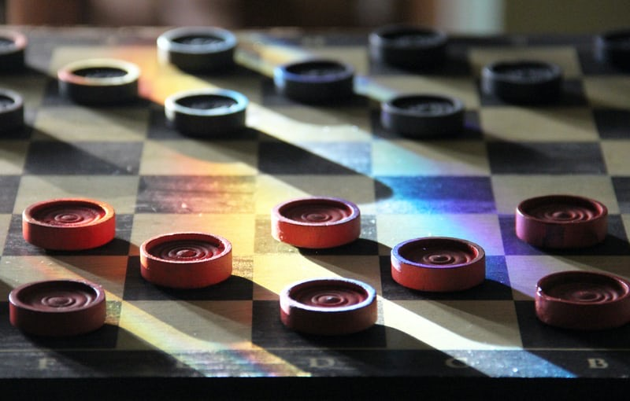
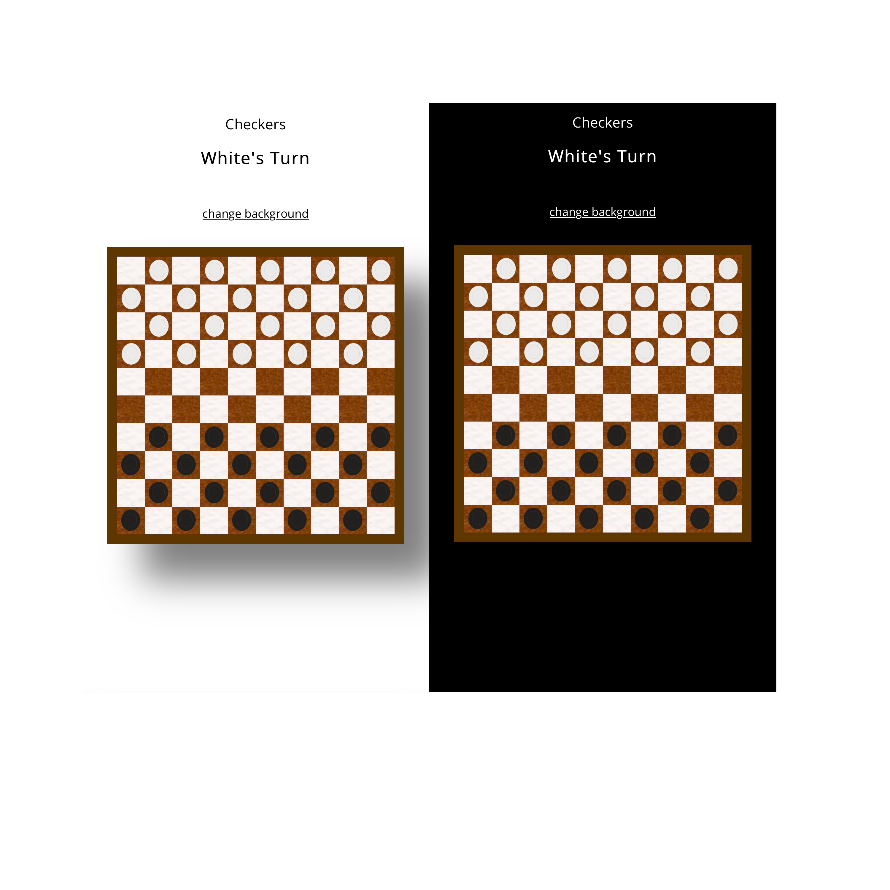

## INTERNATIONAL CHECKERS

a **10x10** board game. The rules are simple :

* You can only move cell by cell forward
* You can capture your opponent's piece
* Once you reach your opponent's camp you can move any distance diagonally
* If your opponent has 0 pieces left, you win!
* If your opponent's last pieces can't move, you win!

## Screenshots

## Technologies Used

* HTML
* CSS
* Javascript (w/ webpack)

## Getting Started

You can play the game right now using this [link] (https://mohameddiopcodes.github.io/checkers/)

## Future Improvements

Here are a couple improvements I'm planning for future releases

* Animations for the end of the game
* Additional board themes
* Additional background themes